##  About Me
- I’m Ujwal Chapagain from Nepal. i am currently leaning towards cybersecurity field. Every Applications/websites/ANYTHING in this profile that is made public was initially built because i needed it personally, i later made those public as i thought others might also benefit from it (There are more to come)

##  My GitHub Stats

  
  

  

  

##  Languages & Tools

> ## Programming Languages

> ## Frontend

    

##  Connect with Me

   

##  Fun Little Ping Pong
<picture>
  <source media="(prefers-color-scheme: dark)" srcset="https://raw.githubusercontent.com/cyprieng/github-breakout/main/example/dark.svg" />
  <source media="(prefers-color-scheme: light)" srcset="https://raw.githubusercontent.com/cyprieng/github-breakout/main/example/light.svg" />
  
</picture>

  

